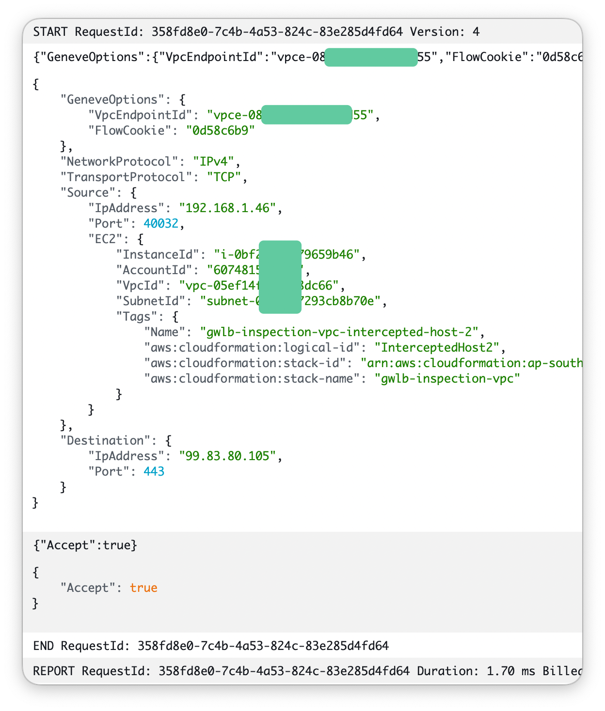
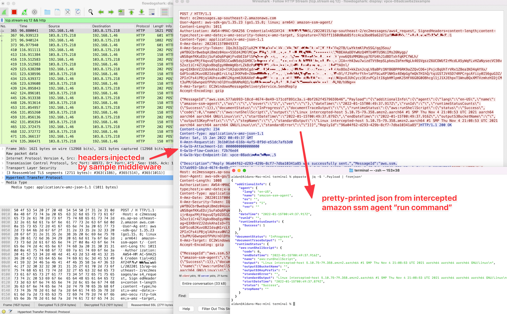
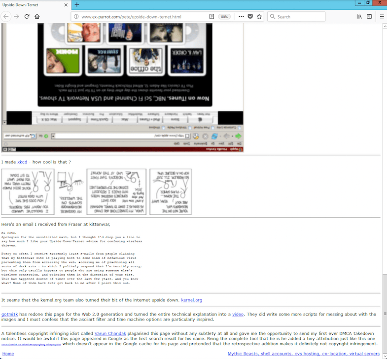
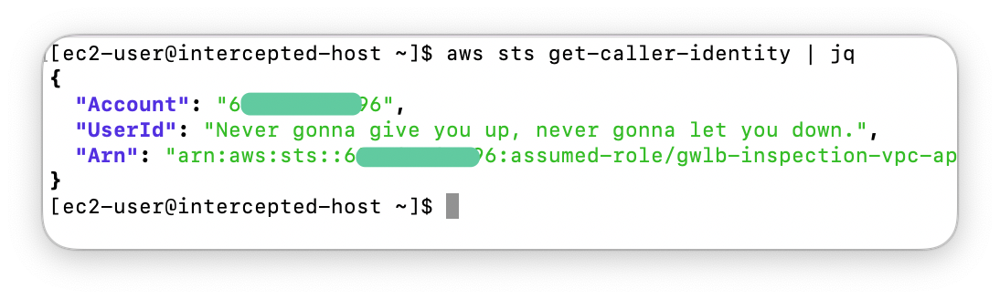
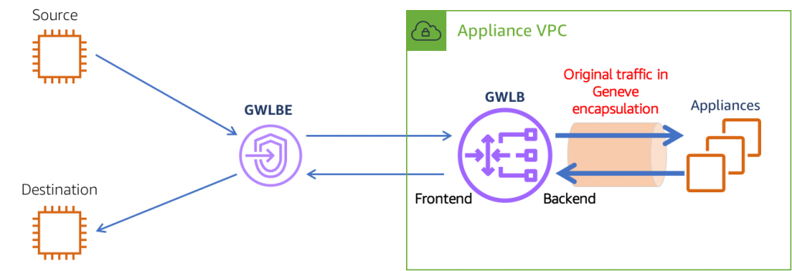
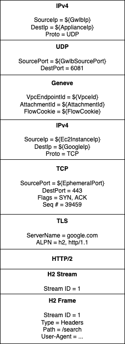
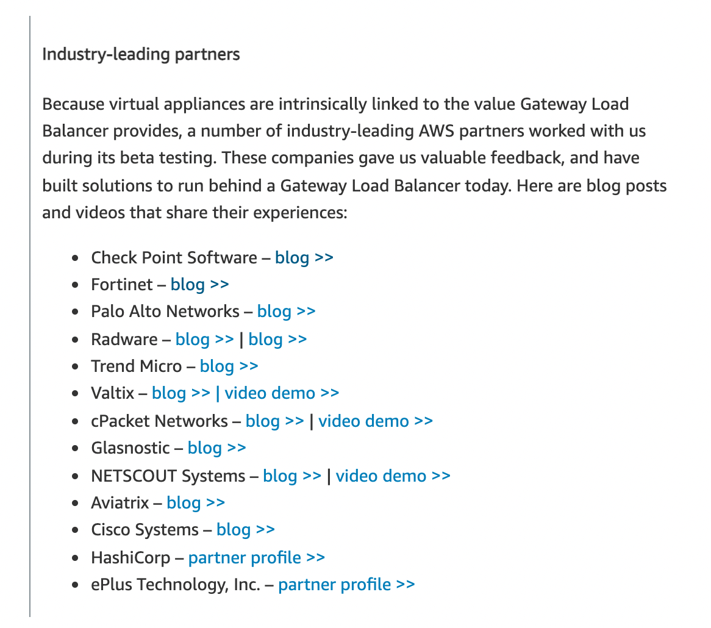

[Twitter thread](https://twitter.com/__steele/status/1481227583274758146)

# flowdog

This is an application/framework for inspection and manipulation of network
traffic in AWS VPCs. Packets routed to or from the Internet, between VPCs,
between subnets can all be programmatically inspected or modified in great
detail.

This is achieved via AWS Gateway Load Balancers. GWLBs are a cloud-native
alternative to NAT instances. They can auto-scale, they can be highly available
across availability zones and they can even be provided as managed services
from entirely separate AWS accounts. 

But they're hard to use*. This project tries to make them easier. See further
down for an explanation of the difficulty.

## Example use cases

These are really just intended to demonstrate that anything is possible in the
world of software-defined networking. Please ping me on [Twitter][twit] with any
cool ideas you have. Or any enhancements to the following ideas.

* [`lambda_acceptor/lambda_acceptor.go`](/examples/lambda_acceptor/lambda_acceptor.go)
  takes the idea of [AWS API Gateway Lambda authorizers][apigw-auth] and applies
  it to VPC flows. At the start of every new connection, a Lambda function is
  invoked and returns a decision about whether to allow or drop the connection.
  It's like security groups 2.0. Input/output looks like this:

  

* [`cloudfront_functions/rick.js`](/examples/cloudfront_functions/rick.js) is
  an example of how the [CloudFront Functions][cff-model] event model can be
  applied to rewriting HTTP(S) requests inside a VPC. In this particular example,
  we're ensuring that any [AWS Workspaces][workspaces] users visiting YouTube
  can only watch one particular video.

* [`flowdogshark/flowdogshark.go`](/examples/flowdogshark/flowdogshark.go) is an
  [`extcap`][extcap] plugin for Wireshark that allows you to live-attach 
  Wireshark to flowdog and capture traffic flowing through your VPC. Given that
  flowdog does TLS interception (see later section in README), it can even use 
  Wireshark's support for decoding TLS. Here's an example of intercepting the
  Amazon SSM agent:

  

* [`account_id_emf/account_id_emf.go`](/examples/account_id_emf/account_id_emf.go)
  is an example of scanning all AWS API calls made within the VPC for SigV4 auth
  headers, [extracting the AWS account ID][extract-acct-id] and emitting it to
  CloudWatch via specially-formatted logs that are turned into metrics. This could
  be used to alert on newly-seen account IDs: a potential indicator of a compromised
  instance.

* [`upsidedown/upsidedown.go`](/examples/upsidedown/upsidedown.go) is an 
  implementation of the classic [Upside-Down-Ternet][upsidedown]. It blurs and 
  rotates every image 180º when browsing the net.

  

* [`sts_rickroll/sts_rickroll.go`](/examples/sts_rickroll/sts_rickroll.go) is
  another silly example. Here we are modifying the response of the AWS API call
  for `aws sts get-caller-identity` to return something unexpected. You could
  equally use the same logic to return your favourite video on every seventh
  object downloaded through an S3 VPC gateway. 

  

* [`gwlb/websocket.go`](/gwlb/websocket.go) is not an example, but I got lazy.
  [Nick Frichette][nickf] had the great suggestion of intercepting the [SSM agent][agent]
  for shenanigans. This code will detect websockets and parse messages, but right
  now only passes them back and forth. Soon™.

* Another example I might do if people find it interesting: Live Wireshark 
  capture of all traffic going into/out of/around a VPC. Wireshark has effective
  support for "plugins" and it would be straight-forward to mirror the traffic
  to a developer's laptop.

* Another TODO: You could save [HAR archives][har] of all web traffic to buckets
  in S3 for later perusal.  

## What about TLS?

As great as GWLBs are, they're not magic. We haven't broken TLS. For this app,
we create a custom root certificate authority and add it to the trust store on
our EC2 instances. Rather than deal in sensitive private key material, we use 
AWS [KMS' support for asymmetric keys][kms] for our private key. 
[`generate.go`](/kmssigner/generate/generate.go) creates a certificate using that
key. That certificate is then stored and trusted on the OS (e.g. in Amazon Linux 2
you would run `cat $CERT >> /usr/share/pki/ca-trust-source/anchors/lol.pem && update-ca-trust`)

Rather than invoking KMS on every TLS connection, on launch this app creates an
ephemeral key pair and certificate in memory, asks KMS to sign it and then uses
that as an intermediate certificate authority. This means we can have fast TLS
de/re-encryption with no stored secrets.

When Wireshark is attached, flowdog can stream TLS key logs in [NSS Key Log Format][klf].
This allows the Wireshark user to view all decrypted TLS traffic without giving
away either the KMS private key (impossible) or intermediate CA private key (very
unwise).

## Why so hard?

(*) GWLBs aren't hard themselves, look at this diagram (from Amazon's [blog post][amz-blog]):

It's inspecting and modifying network traffic in general that is extremely 
difficult. Especially non-trivial modifications.  Take the following diagram as 
an example. This is just one packet in a flow of packets between an EC2 
instance and the Internet when `curl https://google.com` is run.

You can think of this packet as having many layers. Each layer "wraps" the
layer below it. The bottom six layers were sent by the EC2 instance. The top
three layers are GWLB-specific. They identify which VPC endpoint (e.g. customer)
the packet came from and which "flow" of packets this particular packet belongs to.

Say we want to change all web requests to google.com to have the `User-Agent`
request header instead be lower-case, e.g. `user-agent`. This would require us to
parse the formats for:

* The inner IPv4 layer, to identify is this a TCP packet
* The TCP layer, to identify if the destination port is 80 or 443
* The TLS layer, to (magically, for now) decrypt the payload
* The HTTP/2 layer, to inspect the multiplexed streams within
* The frames in each HTTP/2 stream, to identify if they are a `HEADERS` frame.
* The headers in the HTTP/2 frame, to see if the `User-Agent` header is present.

Finally we would have to edit the packet in memory at the right offset to change
`U` to `u` and `A` to `a`, correct the checksums at every layer of the packet
and re-encrypt the TLS payload. That's a lot of work.

And that's a trivial change: the packet length hasn't changed. Imagine if
wanted to insert a few additional headers in that request. Maybe that would
push the packet length over the typical 1500 byte limit for packets on the
Internet. That increases the amount of work needed by orders of magnitude: now
we need to reimplement the TCP state machine, because we'll now need two packets.
And those packets each need sequence numbers. But the original EC2 instance will
get a response from Google for sequence numbers it didn't expect, so the
connection will fail. So what we need to do is instead _terminate_ the TCP
connection at the GWLB appliance and open a _new_ connection to Google from the
GWLB appliance. The app will need to juggle these two TCP connections and pass
the underlying data to and from Google and the EC2 instance, all while keeping
the two connection's different states in sync.

That's so much work that it's no wonder that even after more than year, it's no
wonder that even after more than a year, only massive well-funded vendors have
implemented this capability. And even then, it looks like they're limited to
either read-only inspection or dropping suspicious packets.

So I built this thing. It uses a handful of packages to make traffic inspection
and modification accessible to even developers like you or me. Those packages
are:

* [`inet.af/netstack`](https://pkg.go.dev/inet.af/netstack): a reimplementation
  of the entire Linux TCP/IP stack in Go, extracted from the gVisor project.

* [`github.com/google/gopacket`](https://pkg.go.dev/github.com/google/gopacket)
  to extract and parse the Geneve, IP, TCP, UDP, etc layers from the raw packets
  delivered by the GWLB.

* [`httputil`](https://pkg.go.dev/net/http/httputil) in the Go stdlib, to
  reverse-proxy HTTP and HTTPS traffic and  parse flows into individual request
  and response objects.

* [`github.com/aws/aws-sdk-go`](https://pkg.go.dev/github.com/aws/aws-sdk-go) to
  use AWS KMS asymmetric keys for the root certificate authority that can be
  installed on EC2 instances for transparent TLS decryption - without having to
  manage a highly-sensitive private key.

* [`rogchap.com/v8go`](https://pkg.go.dev/rogchap.com/v8go) to embed the V8
  JavaScript engine into Go, so that we can write scripts to modify traffic
  in JS, which is more familiar than Go to many developers.

[extcap]: https://www.wireshark.org/docs/man-pages/extcap.html
[klf]: https://developer.mozilla.org/en-US/docs/Mozilla/Projects/NSS/Key_Log_Format
[twit]: https://twitter.com/__steele
[kms]: https://docs.aws.amazon.com/kms/latest/developerguide/symmetric-asymmetric.html
[cff-model]: https://docs.aws.amazon.com/AmazonCloudFront/latest/DeveloperGuide/writing-function-code.html
[workspaces]: https://aws.amazon.com/workspaces/
[extract-acct-id]: https://awsteele.com/blog/2020/09/26/aws-access-key-format.html
[apigw-auth]: https://docs.aws.amazon.com/apigateway/latest/developerguide/apigateway-use-lambda-authorizer.html
[nickf]: https://github.com/Frichetten
[agent]: https://docs.aws.amazon.com/systems-manager/latest/userguide/ssm-agent.html
[har]: https://en.wikipedia.org/wiki/HAR_(file_format)
[amz-blog]: https://aws.amazon.com/blogs/networking-and-content-delivery/integrate-your-custom-logic-or-appliance-with-aws-gateway-load-balancer/
[upsidedown]: https://www.ex-parrot.com/pete/upside-down-ternet.html
